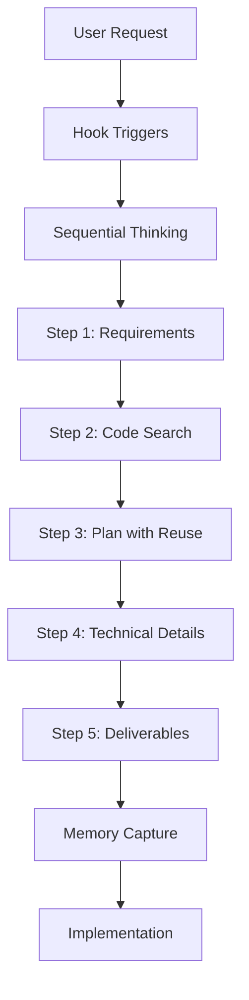

# Code Reuse Process Design

## Implementation Strategy

### 1. CLAUDE.md Enhancement
Update the main configuration file with:
- Enhanced Development Philosophy (code reuse first)
- New Code Reuse Workflow Template section
- Updated memory patterns (REUSABLE_COMPONENT, etc.)
- Enhanced production checklist
- Additional automation triggers

### 2. Hook Integration Points

#### Quality Hook Enhancement
- Add duplicate code detection warnings
- Suggest existing components when similar code detected
- Track code reuse metrics

#### Pattern Extraction Hook
- Re-enable and enhance for reuse pattern detection
- Extract common function signatures
- Build component catalog automatically

#### Workflow Automation Hook
- Trigger code search on keywords: "feature", "implement", "create"
- Automatically invoke Sequential Thinking for analysis
- Score tasks higher when refactoring is mentioned

### 3. Memory System Integration

#### New Pattern Types
```json
{
  "type": "REUSABLE_COMPONENT",
  "component": "utility/formatDate",
  "usage_count": 5,
  "locations": ["src/utils/date.js:23"]
}
```

#### Automatic Capture Triggers
- When creating utility functions
- When extracting common code
- When identifying duplicate patterns

### 4. Command Structure Extension

No new commands needed - leverage existing:
- `/memory search` - Find reusable components
- `/logic help reuse` - Get code reuse guidance
- Sequential Thinking tool - Automatic analysis

### 5. Workflow Process Flow



## Technical Architecture

### File Structure
```
.claude/
├── CLAUDE.md (updated with workflow)
├── logic/
│   ├── hooks/
│   │   ├── quality/ (enhanced)
│   │   └── pattern-extraction/ (re-enabled)
│   └── memory/ (pattern capture)
└── knowledge/
    └── patterns.json (reusable components)
```

### Integration Safety
- All changes are additive (no breaking changes)
- Feature flags for gradual rollout
- Emergency disable via `/logic emergency`
- Fallback to manual process if automation fails

### Performance Considerations
- Cache search results for 24 hours
- Parallel analysis using Task agents
- Incremental pattern extraction
- Non-blocking hook execution