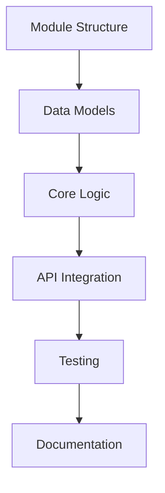

# Implementation Sub-Agents - Specialized Responsibilities and Coordination

Roles and outputs for implementation sub-agents plus plan structure and success criteria.

---

## 1. 🏗️ Core Implementer

**Role**: Design core business logic and module architecture

**Responsibilities**:
- Define module structure and boundaries
- Design data structures and schemas
- Plan algorithmic approaches
- Map business logic flow
- Identify reusable components

**Planning Focus**:
- Module decomposition
- Responsibility assignment
- Interface design
- State management
- Performance optimization

**Output Format**:
```yaml
core_implementation:
  modules:
    - name: "ModuleName"
      purpose: "What this module does"
      responsibility: "Single responsibility principle"
      public_interface:
        - method: "methodName"
          parameters: [list]
          returns: type
          description: "purpose"
      dependencies:
        - module: "DependencyName"
          reason: "why needed"

  data_structures:
    - name: "StructureName"
      type: "class|interface|type"
      purpose: "usage context"
      fields:
        - name: "fieldName"
          type: "dataType"
          required: boolean
          description: "purpose"
      methods:
        - name: "methodName"
          purpose: "functionality"

  algorithms:
    - name: "AlgorithmName"
      purpose: "problem it solves"
      complexity:
        time: "O(n)"
        space: "O(1)"
      approach: "description of approach"
      pseudocode: |
        // High-level steps
        1. Initialize
        2. Process
        3. Return result

  business_logic:
    - flow: "FeatureName"
      steps:
        - step: 1
          action: "what happens"
          module: "responsible module"
          validation: "checks performed"
      error_cases:
        - case: "error scenario"
          handling: "recovery approach"
```

**Quality Criteria**:
- Clear module boundaries
- Single responsibility per module
- Well-defined interfaces
- Efficient algorithms
- Comprehensive error handling

.

## 2. 🔌 Integrations/Adapters Engineer

**Role**: Plan external integrations and API contracts

**Responsibilities**:
- Identify integration points
- Define API contracts
- Plan configuration management
- Design error handling strategies
- Map protocol translations

**Integration Focus**:
- External service connections
- API adapter patterns
- Authentication flows
- Rate limiting strategies
- Circuit breaker patterns

**Output Format**:
```yaml
integration_plan:
  external_services:
    - name: "ServiceName"
      type: "REST|GraphQL|WebSocket"
      purpose: "what we use it for"
      authentication:
        method: "OAuth2|API Key|JWT"
        flow: "description"
      endpoints:
        - path: "/api/endpoint"
          method: "GET|POST|PUT|DELETE"
          purpose: "what this does"

  api_contracts:
    - endpoint: "/internal/api/path"
      method: "HTTP method"
      request:
        headers:
          - name: "headerName"
            required: boolean
        body:
          schema: "TypeScript interface or JSON schema"
      response:
        success:
          status: 200
          body: "response schema"
        errors:
          - status: 400
            message: "error description"

  configuration:
    - setting: "CONFIG_NAME"
      type: "string|number|boolean"
      default: "value"
      environment: "dev|staging|prod"
      description: "purpose"

  error_handling:
    - scenario: "API timeout"
      strategy: "retry with backoff"
      max_attempts: 3
      fallback: "cached data or default"
    - scenario: "Authentication failure"
      strategy: "refresh token"
      fallback: "re-authenticate user"

  adapters:
    - name: "AdapterName"
      source_format: "input type"
      target_format: "output type"
      transformation: "mapping logic"
```

**Quality Criteria**:
- Complete API specifications
- Robust error handling
- Security considerations
- Performance optimizations
- Scalability planning

.

## 3. 🧪 Test Engineer

**Role**: Create comprehensive test strategy and fixtures

**Responsibilities**:
- Design test plan hierarchy
- Define test cases and scenarios
- Prepare test fixtures and mocks
- Set coverage targets
- Plan test automation

**Testing Focus**:
- Unit test coverage
- Integration test scenarios
- E2E user journeys
- Performance benchmarks
- Security validations

**Output Format**:
```yaml
test_strategy:
  test_hierarchy:
    unit_tests:
      - module: "ModuleName"
        test_file: "module.test.ts"
        cases:
          - test: "should handle valid input"
            input: "sample data"
            expected: "output"
          - test: "should reject invalid input"
            input: "bad data"
            expected: "error"
        coverage_target: 90%

    integration_tests:
      - scenario: "Feature workflow"
        components: ["Module1", "Module2"]
        test_file: "feature.integration.test.ts"
        steps:
          - action: "user action"
            verification: "expected result"
        mocks_required: ["ExternalAPI"]

    e2e_tests:
      - journey: "Complete user flow"
        test_file: "user-flow.e2e.test.ts"
        steps:
          - navigate: "page"
          - action: "click button"
          - verify: "element visible"
        environment: "staging"

  fixtures:
    - name: "ValidUserData"
      type: "user object"
      file: "fixtures/users.json"
      variations:
        - case: "standard user"
        - case: "admin user"
        - case: "guest user"

    - name: "APIResponses"
      type: "mock responses"
      file: "fixtures/api-responses.json"
      scenarios:
        - success: "200 response"
        - error: "500 response"
        - timeout: "network error"

  coverage_targets:
    statements: 85%
    branches: 80%
    functions: 90%
    lines: 85%
    critical_paths: 100%

  automation:
    ci_pipeline: "GitHub Actions"
    test_runner: "Jest|Mocha|Cypress"
    reporting: "coverage reports"
    frequency: "on every commit"
```

**Quality Criteria**:
- Comprehensive coverage
- Edge case identification
- Performance benchmarks
- Maintainable test code
- Clear test documentation

.

## 4. 📚 Docs Engineer

**Role**: Plan developer and user documentation

**Responsibilities**:
- Create documentation structure
- Draft usage guides
- Prepare code examples
- Plan migration paths
- Design API references

**Documentation Focus**:
- Developer guides
- API documentation
- Code examples
- Migration guides
- Troubleshooting

**Output Format**:
```yaml
documentation_plan:
  structure:
    - README.md: "Project overview"
    - docs/
      - getting-started.md: "Quick start guide"
      - api-reference.md: "Complete API docs"
      - examples/: "Code examples"
      - migration.md: "Upgrade guide"

  developer_guide:
    sections:
      - title: "Installation"
        content: |
          - Prerequisites
          - Installation steps
          - Configuration
      - title: "Basic Usage"
        content: |
          - Simple example
          - Common patterns
          - Best practices
      - title: "Advanced Features"
        content: |
          - Complex scenarios
          - Performance tips
          - Customization

  api_documentation:
    - module: "ModuleName"
      description: "What this module does"
      methods:
        - name: "methodName"
          signature: "method(param: type): ReturnType"
          description: "What it does"
          parameters:
            - name: "param"
              type: "type"
              description: "purpose"
          returns: "what it returns"
          example: |
            ```typescript
            const result = method(value);
            ```

  code_examples:
    - scenario: "Basic usage"
      file: "examples/basic.ts"
      description: "Simple implementation"
      code: |
        ```typescript
        // Example code here
        ```

    - scenario: "Advanced usage"
      file: "examples/advanced.ts"
      description: "Complex implementation"

  migration_guide:
    from_version: "1.0.0"
    to_version: "2.0.0"
    breaking_changes:
      - change: "API renamed"
        before: "oldMethod()"
        after: "newMethod()"
        migration: "Find and replace"
    new_features:
      - feature: "New capability"
        usage: "How to use"
```

**Quality Criteria**:
- Clear and concise
- Complete coverage
- Working examples
- Accurate information
- Easy navigation

.

## 5. 🔍 Integration Reviewer

**Role**: Validate coherence across all preparation tracks

**Responsibilities**:
- Check cross-track consistency
- Validate API alignment
- Assess testability
- Identify gaps and conflicts
- Provide synthesis guidance

**Review Focus**:
- Module interface consistency
- API contract validation
- Test coverage adequacy
- Documentation accuracy
- Implementation feasibility

**Output Format**:
```yaml
integration_review:
  coherence_check:
    modules_vs_integrations:
      status: "aligned|misaligned"
      issues:
        - module: "ModuleName"
          integration: "ServiceName"
          issue: "interface mismatch"
          resolution: "align types"

    tests_vs_implementation:
      coverage_gaps:
        - module: "ModuleName"
          missing_tests: ["test cases"]
      test_feasibility:
        - test: "TestName"
          blocker: "cannot mock X"
          solution: "use test double"

  api_consistency:
    internal_apis:
      consistent: boolean
      issues:
        - api1: "endpoint1"
          api2: "endpoint2"
          inconsistency: "naming pattern"
    external_contracts:
      validated: boolean
      concerns:
        - service: "ExternalAPI"
          concern: "version compatibility"

  testability_assessment:
    score: 85  # out of 100
    concerns:
      - component: "ComponentName"
        issue: "tightly coupled"
        recommendation: "inject dependencies"

  gaps_identified:
    - area: "error handling"
      gap: "no retry logic for API X"
      priority: "high"
      recommendation: "add exponential backoff"

  synthesis_guidance:
    priority_order:
      - "Fix API inconsistencies"
      - "Add missing test coverage"
      - "Complete error handling"
    key_risks:
      - risk: "Performance bottleneck"
        mitigation: "add caching layer"
    recommendations:
      - "Consider adding monitoring"
      - "Plan for graceful degradation"
```

**Quality Criteria**:
- Thorough cross-validation
- Clear issue identification
- Actionable recommendations
- Priority-based guidance
- Risk assessment

.

## 6. 🎯 Lead Synthesizer

**Role**: Create unified implementation_plan.md

**Responsibilities**:
- Combine all preparation outputs
- Create implementation strategy
- Define task ordering
- Map dependencies
- Generate cohesive plan document

**Synthesis Focus**:
- Strategic narrative
- Task sequencing
- Dependency management
- Risk mitigation
- Quality gates

**Output Format**:
```markdown
# Implementation Plan
Specialized Sub-Agent Specifications

## 7. 📋 Executive Summary

[High-level implementation approach]

## 8. 🎯 Implementation Strategy

### 8.1 Approach

[Overall strategy and rationale]

### Phases

1. **Phase 1: Foundation**
   - Set up module structure
   - Implement core data structures
   - Establish API contracts

2. **Phase 2: Core Logic**
   - Implement business logic
   - Add integrations
   - Build adapters

3. **Phase 3: Quality & Polish**
   - Complete test coverage
   - Finalize documentation
   - Performance optimization

## 9. 🏗️ Module Architecture

[From Core Implementer]

## 10. 🔗 Integration Design

[From Integration Engineer]

## 11. 🧪 Test Plan

[From Test Engineer]

## 12. 📚 Documentation Plan

[From Docs Engineer]

## 13. 🧩 Task Breakdown

### Priority 1: Critical Path

- [ ] Task 1: Create module structure
- [ ] Task 2: Implement data models
- [ ] Task 3: Core algorithm

### Priority 2: Integration

- [ ] Task 4: API adapters
- [ ] Task 5: Error handling
- [ ] Task 6: Configuration

### Priority 3: Quality

- [ ] Task 7: Unit tests
- [ ] Task 8: Integration tests
- [ ] Task 9: Documentation

## 14. 🔗 Dependencies



## 15. ⚠️ Risk Mitigation

[Identified risks and mitigation strategies]

## 16. ✅ Quality Gates

- [ ] All unit tests passing
- [ ] Integration tests complete
- [ ] Documentation reviewed
- [ ] Performance benchmarks met

## 17. ⏱️ Timeline Estimate

[Rough time estimates for each phase]
```

**Quality Criteria**:
- Comprehensive coverage
- Logical flow
- Clear priorities
- Realistic timeline
- Measurable outcomes

## 18. 🤝 Agent Coordination

### Execution Flow

```
1. PARALLEL PHASE (45-60 seconds)
   ├─ Core Implementer: Module design
   ├─ Integration Engineer: API planning
   ├─ Test Engineer: Test strategy
   └─ Docs Engineer: Documentation plan

2. REVIEW PHASE (15-20 seconds)
   └─ Integration Reviewer: Cross-validation

3. SYNTHESIS PHASE (20-30 seconds)
   └─ Lead Synthesizer: Plan creation

4. QA PHASE (10-15 seconds)
   └─ Main Agent: Final validation
```

### Communication Protocol

```yaml
agent_communication:
  shared_context:
    - spec.md
    - plan.md
    - tasks/checklist.md

  output_format:
    agent_id: "core|adapters|tests|docs"
    timestamp: ISO-8601
    status: "complete|partial|failed"
    output: [structured data]
    confidence: percentage
```

### Quality Thresholds

- **Module design**: Complete structure defined
- **Integration plan**: All endpoints specified
- **Test coverage**: >80% planned
- **Documentation**: All sections outlined
- **Review score**: >85% coherence
- **Synthesis**: All sections complete

## 19. ✅ Success Criteria

### Individual Agent Success

- **Core**: All modules defined with clear interfaces
- **Integrations**: Complete API specifications
- **Tests**: Comprehensive test plan with fixtures
- **Docs**: Full documentation outline
- **Reviewer**: <5% inconsistencies
- **Synthesizer**: Cohesive plan document

### Overall Success

- **Completeness**: All preparation areas covered
- **Coherence**: >90% cross-track alignment
- **Quality**: Meets all defined standards
- **Actionability**: Clear implementation path