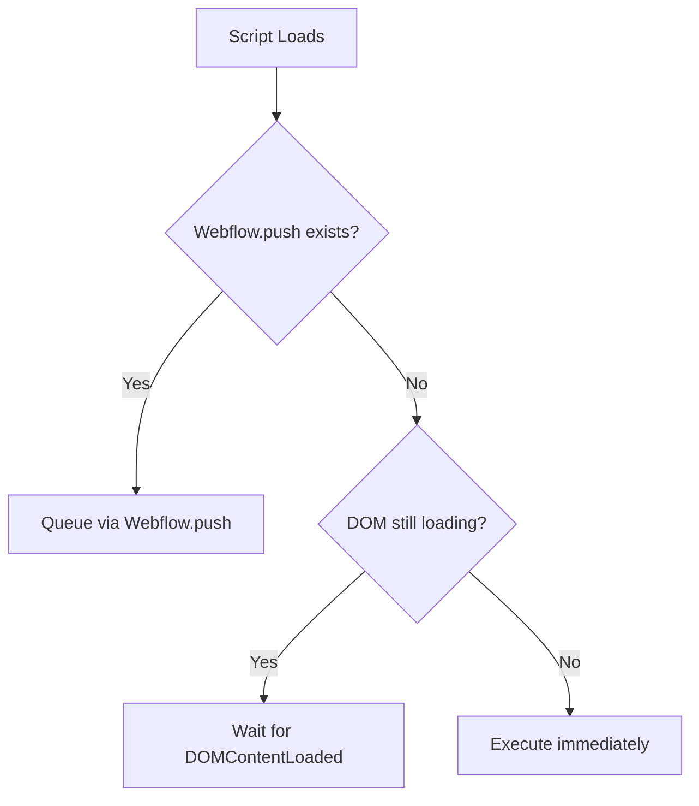

# Webflow Initialization Pattern - Quick Reference

The mandatory initialization pattern for all JavaScript components in Webflow projects. This pattern ensures proper loading, prevents double initialization, and respects Webflow's asynchronous architecture.

.

## 1. 🎯 Objective

Define and enforce the single correct initialization pattern for Webflow JavaScript. This pattern is mandatory across all 32+ JavaScript files in the project.

**Category**: critical
**Tags**: webflow, initialization, javascript, pattern
**Priority**: critical

.

## 2. ✅ The ONLY Correct Pattern

```javascript
(() => {
  function init_component() {
    // Your initialization code here
  }

  // MANDATORY: Use this exact pattern with else if
  if (window.Webflow && window.Webflow.push) {
    window.Webflow.push(init_component);
  } else if (document.readyState === 'loading') {
    document.addEventListener('DOMContentLoaded', init_component);
  } else {
    init_component();
  }
})();
```

.

## 3. ❌ Common Mistakes to Avoid

### 3.1 Mistake 1: Separate if Statements (WRONG)
```javascript
// ❌ NEVER DO THIS - Causes double initialization
if (window.Webflow && window.Webflow.push) {
  window.Webflow.push(init);
}
if (document.readyState === 'loading') {  // Missing "else"
  document.addEventListener('DOMContentLoaded', init);
}
```

### 3.2 Mistake 2: Direct DOMContentLoaded (WRONG)
```javascript
// ❌ NEVER DO THIS - Ignores Webflow's loading system
document.addEventListener('DOMContentLoaded', init);
```

### 3.3 Mistake 3: jQuery Ready (WRONG)
```javascript
// ❌ NEVER DO THIS - Not compatible with async loading
$(document).ready(function() {
  // code
});
```

### 3.4 Mistake 4: Window.onload (WRONG)
```javascript
// ❌ NEVER DO THIS - Too late and overwrites other handlers
window.onload = function() {
  // code
};
```

.

## 4. 🎯 Why This Pattern?

1. **Webflow.push** - Preferred method, queues initialization properly
2. **else if** - Prevents double initialization (critical!)
3. **readyState check** - Handles various loading scenarios
4. **Immediate execution** - Runs if DOM already loaded

.

## 5. 📋 Pattern Checklist

- [ ] Wrapped in IIFE `(() => { ... })()`
- [ ] Uses `else if` not separate `if` statements
- [ ] Checks `window.Webflow.push` first
- [ ] Falls back to `DOMContentLoaded` only if needed
- [ ] Has immediate execution path

.

## 6. 🔍 How It Works



.

## 7. 📁 Implementation Examples

### 7.1 Files Using This Pattern

All 32+ JavaScript files in the project use this pattern, including:
- `/src/contact/form_handler.js`
- `/src/contact/form_validation.js`
- `/src/link/link_hero.js`
- `/src/link/link_grid.js`
- `/src/navigation/mobile_menu.js`
- `/src/navigation/dropdown_menu.js`
- `/src/video/video_play_on_hover.js`
- `/src/hero/hero_video.js`
- And 24+ more...

### 7.2 Quick Test

Add this to your page to verify initialization:

```javascript
console.log('Initialization check:', {
  'Webflow.push available': !!(window.Webflow && window.Webflow.push),
  'DOM state': document.readyState,
  'Should use': window.Webflow?.push ? 'Webflow.push' :
                document.readyState === 'loading' ? 'DOMContentLoaded' :
                'Immediate execution'
});
```

.

## 8. 🚨 Enforcement

This pattern is:
- **Required** by constitution.md (Section II)
- **Documented** in AGENTS.md (Webflow Initialization Pattern)
- **Specified** in code_standards.md (Section 3.5)
- **Demonstrated** in webflow_development.md (Section 4)

### 8.1 References

- [webflow_development.md](./webflow_development.md) - Section 4: Universal Initialization
- [AGENTS.md](/AGENTS.md) - Webflow Initialization Pattern section
- [constitution.md](/.specify/memory/constitution.md) - Platform Constraints
- [code_standards.md](./code_standards.md) - Section 3.5

.

**Remember**: When in doubt, copy the pattern at the top of this document exactly. The `else if` is not optional!