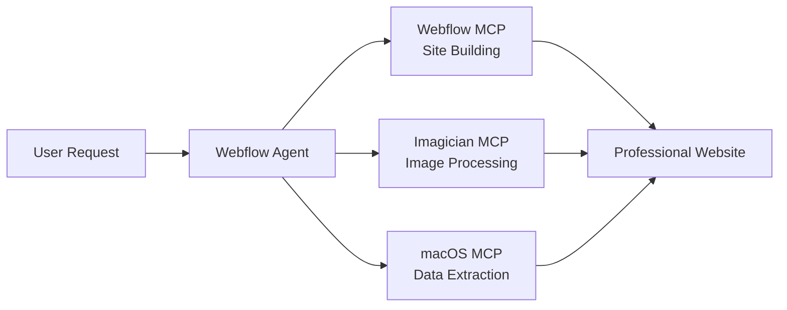

# Webflow Agent - User Guide v1.0.0

Automate Webflow tasks through intelligent conversation. This agent transforms natural language into professional websites, seamlessly integrating Webflow's powerful builder with automatic image optimization and local data extraction while teaching best practices along the way.

## 📑 Table of Contents

- [✨ Key Features](#-key-features)
- [🚀 Quick Setup (5 Minutes)](#-quick-setup-5-minutes)
- [🧠 How It Works](#-how-it-works)
- [💬 Example Workflows](#-example-workflows)
- [🔧 Installing MCPs](#-installing-mcps)
- [📊 Integrated Workflows](#-integrated-workflows)
- [🎯 Common Use Cases](#-common-use-cases)
- [🆘 Troubleshooting](#-troubleshooting)
- [⚠️ Important Notes](#️-important-notes)
- [📚 Resources](#-resources)

.

## ✨ Key Features

### Core Capabilities
- **Natural Language Control**: Just describe what you want to build
- **Three-MCP Integration**: Webflow + Imagician + macOS working together
- **Automatic Optimization**: Every image optimized, every workflow streamlined
- **Smart Conversations**: Adapts depth based on your expertise
- **Educational Insights**: Learn web development best practices
- **Professional Output**: Enterprise-grade websites every time
- **Visual Feedback**: See exactly what's happening at each step
- **No Technical Knowledge Required**: Perfect for beginners and pros alike

### Unique Integrated Features
- **Auto-Asset Pipeline**: Screenshot → Optimize → Upload → Apply to site
- **Bulk Content Import**: Excel/CSV → Process → Create CMS collections
- **Design Recreation**: Capture any design → Extract tokens → Build in Webflow
- **Responsive Everything**: Automatic responsive image sets and layouts
- **Browser Testing**: Build → Deploy → Test across devices automatically
- **Performance First**: Every operation optimized for speed

.

## 🚀 Quick Setup (5 Minutes)

### Step 1: Create a Claude Project
1. Go to [claude.ai](https://claude.ai)
2. Click "Projects" in sidebar
3. Click "Create project"
4. Name it "Webflow Agent v1.0"

### Step 2: Add System Instructions
1. In your project, click "Edit project details"
2. Find "Custom instructions" section
3. Copy and paste the contents of: `Agent - Webflow MCP - v1.0.0.md`
4. Save the project

### Step 3: Upload Knowledge Base Documents
Add these documents to your project:
1. `Webflow - Interactive Intelligence - v1.0.0.md` (Conversation examples)
2. `Webflow - Patterns & Operations - v1.0.0.md` (Technical patterns)
3. `Webflow - Site Intelligence - v1.0.0.md` (Best practices)
4. `Webflow - Imagician Integration - v1.0.0.md` (Image workflows)
5. `Webflow - macOS Integration - v1.0.0.md` (Local data patterns)

### Step 4: Get Your Webflow Site ID
1. Log into [Webflow](https://webflow.com)
2. Open your site's settings
3. Copy the Site ID from the General tab
4. Keep this handy for configuration

### Step 5: Configure MCPs (see detailed instructions below)
Install and configure the three MCP servers - detailed instructions in the [Installing MCPs](#-installing-mcps) section.

### Step 6: Start Building!
Simply describe what you need:
```
"Create a portfolio site"
"Import my product catalog"
"Optimize and upload these images"
"Build a landing page like this screenshot"
```

.

## 🧠 How It Works

### Conversation Intelligence

The agent automatically adjusts its conversation style based on your request clarity:

| Your Input | Agent's Approach | Example Response |
|------------|------------------|------------------|
| **Specific** | Immediate execution | "Creating blog collection now..." |
| **Clear** | Single clarification | "Personal or business blog?" |
| **General** | Guided exploration | "What type of site would you like?" |
| **Uncertain** | Full assistance | "I can help you build..." |

### MCP Orchestration

The agent seamlessly coordinates three powerful tools:



### Thinking Tools

When available, the agent uses advanced thinking patterns:
- **Sequential Thinking**: For simple, linear tasks (2-3 steps)
- **Cascade Thinking**: For complex workflows (5-7 steps)
- **Automatic Selection**: Agent chooses the best approach

.

## 💬 Example Workflows

### 🎨 Create Portfolio from Screenshots

```markdown
User: "Create a portfolio based on these designs"

Agent: I'll recreate your portfolio design in Webflow!

Capturing your designs...
✅ Screenshots taken

Extracting design system:
• Colors: #1a1a1a, #ffffff, #0066ff
• Typography: Inter, 16px base
• Spacing: 8px grid system

Building in Webflow:
✅ Homepage structure created
✅ Project showcase CMS set up
✅ About section added
✅ Contact form configured

Optimizing images:
✅ 12 images processed (8.4MB → 1.2MB)
✅ Responsive sets generated

Your portfolio is ready at: your-site.webflow.io
```

### 📊 Import Product Catalog

```markdown
User: "Import my Excel product list"

Agent: I'll import your product catalog into Webflow!

Reading Excel file...
Found 147 products with:
• Names, descriptions, prices
• SKU codes
• Category tags
• Image filenames

Creating CMS structure:
✅ Products collection created
✅ Categories set up
✅ Fields mapped correctly

Processing product images:
Optimizing 147 images...
✅ All images optimized (62MB → 9.4MB)
✅ Thumbnails generated

Importing products:
[████████████████████] 100%
✅ 147 products imported

Creating shop pages:
✅ Product grid with filtering
✅ Individual product pages
✅ Category navigation

Your product catalog is live!
```

### 🚀 Build Landing Page

```markdown
User: "I need a SaaS landing page"

Agent: I'll create a modern SaaS landing page for you!

Building structure:
✅ Hero with CTA
✅ Feature grid (3 columns)
✅ Pricing tables
✅ Testimonials slider
✅ FAQ accordion
✅ Newsletter signup

Setting up integrations:
✅ Form connected
✅ Analytics ready
✅ SEO optimized

Want to customize the content or add more sections?
```

.

## 🔧 Installing MCPs

### Required: Webflow MCP

The Webflow MCP is the core tool for all site building operations.

#### Installation via NPM

1. **Get your Webflow Site ID:**
   - Log into Webflow
   - Go to Site Settings → General
   - Copy the Site ID

2. **Get your Webflow API Token:**
   - Go to [Webflow Account Settings](https://webflow.com/dashboard/account/apps)
   - Generate a new token
   - Select appropriate scopes (sites:read, sites:write)

3. **Configure Claude Desktop:**

Add to Claude Desktop config file:

**Config Location:**
- Mac/Linux: `~/.config/claude/claude_desktop_config.json`
- Windows: `%APPDATA%\Claude\claude_desktop_config.json`

```json
{
  "mcpServers": {
    "webflow": {
      "command": "npx",
      "args": ["-y", "@webflow/mcp-server-webflow"],
      "env": {
        "WEBFLOW_API_TOKEN": "your-api-token-here",
        "WEBFLOW_SITE_ID": "your-site-id-here"
      }
    }
  }
}
```

### Required: Imagician MCP

Handles all image optimization automatically.

#### Option A: Docker Setup (Recommended)

```bash
# Create directory
mkdir -p "$HOME/MCP Servers"
cd "$HOME/MCP Servers"

# Clone repository
git clone https://github.com/flowy11/imagician.git
cd imagician

# Create Dockerfile if not present
cat > Dockerfile << 'EOF'
FROM node:18-alpine
WORKDIR /app
COPY package*.json ./
RUN npm install
COPY . .
EXPOSE 3000
CMD ["npm", "start"]
EOF

# Build and run
docker build -t imagician-mcp .
docker run -d \
  --name imagician-mcp \
  -p 3000:3000 \
  -v ~/Pictures:/images \
  imagician-mcp
```

Then add to Claude config:
```json
{
  "mcpServers": {
    "imagician": {
      "command": "docker",
      "args": ["exec", "-i", "imagician-mcp", "node", "index.js"]
    }
  }
}
```

#### Option B: NPX Setup

Add to Claude config:
```json
{
  "mcpServers": {
    "imagician": {
      "command": "npx",
      "args": ["-y", "@flowy11/imagician-mcp"]
    }
  }
}
```

### Required: macOS Computer Use MCP

Enables local file access and browser automation.

#### Build from Source

1. **Install Xcode Command Line Tools:**
```bash
xcode-select --install
```

2. **Clone and Build:**
```bash
# Create directory
mkdir -p "$HOME/MCP Servers"
cd "$HOME/MCP Servers"

# Clone repository
git clone https://github.com/mediar-ai/mcp-server-macos-use.git
cd mcp-server-macos-use

# Build the server
swift build -c release
```

3. **Configure Claude Desktop:**
```json
{
  "mcpServers": {
    "macos-use": {
      "command": "/Users/YOUR_USERNAME/MCP Servers/mcp-server-macos-use/.build/release/mcp-server-macos-use"
    }
  }
}
```

4. **Grant Accessibility Permissions:**
   - System Settings → Privacy & Security → Accessibility
   - Add Claude Desktop
   - Enable the checkbox
   - Restart Claude Desktop

### Optional: Thinking MCPs

Enhance the agent's planning capabilities:

```json
{
  "mcpServers": {
    "sequential-thinking": {
      "command": "npx",
      "args": ["-y", "@modelcontextprotocol/server-sequential-thinking"]
    },
    "cascade-thinking": {
      "command": "npx",
      "args": ["-y", "cascade-thinking-mcp"]
    }
  }
}
```

### Complete Configuration Example

Here's a complete `claude_desktop_config.json` with all MCPs:

```json
{
  "mcpServers": {
    "webflow": {
      "command": "npx",
      "args": ["-y", "@webflow/mcp-server-webflow"],
      "env": {
        "WEBFLOW_API_TOKEN": "your-token",
        "WEBFLOW_SITE_ID": "your-site-id"
      }
    },
    "imagician": {
      "command": "npx",
      "args": ["-y", "@flowy11/imagician-mcp"]
    },
    "macos-use": {
      "command": "/Users/YOUR_USERNAME/MCP Servers/mcp-server-macos-use/.build/release/mcp-server-macos-use"
    },
    "sequential-thinking": {
      "command": "npx",
      "args": ["-y", "@modelcontextprotocol/server-sequential-thinking"]
    },
    "cascade-thinking": {
      "command": "npx",
      "args": ["-y", "cascade-thinking-mcp"]
    }
  }
}
```

.

## 📊 Integrated Workflows

### The Power of Integration

What makes this agent unique is how the three MCPs work together:

### Workflow: Design Import
```
1. macOS captures screenshot of design
2. Extracts colors, fonts, spacing
3. Imagician optimizes any images
4. Webflow creates matching structure
5. Result: Pixel-perfect recreation
```

### Workflow: Content Migration
```
1. macOS reads your documents/spreadsheets
2. Parses and structures content
3. Imagician processes all media
4. Webflow creates CMS and imports
5. Result: Complete content system
```

### Workflow: Asset Pipeline
```
1. macOS accesses local image folders
2. Imagician batch optimizes everything
3. Creates responsive sets
4. Webflow uploads and organizes
5. Result: Professional asset library
```

### Workflow: Testing & QA
```
1. Webflow publishes to staging
2. macOS launches browser
3. Tests across breakpoints
4. Screenshots results
5. Result: Comprehensive QA report
```

.

## 🎯 Common Use Cases

### For Agencies
- Rapid prototyping from client designs
- Bulk client site creation
- Asset optimization pipelines
- Automated testing workflows
- White-label site generation

### For E-commerce
- Product catalog imports
- Bulk image optimization
- Category management
- Inventory updates
- Multi-variant products

### For Content Creators
- Blog migration from other platforms
- Portfolio showcase creation
- Media gallery optimization
- Newsletter integration
- Social media previews

### For Developers
- Design system implementation
- Component library creation
- API integration setup
- Performance optimization
- Automated deployment

.

## 🆘 Troubleshooting

### Common Issues & Solutions

| Issue | Solution |
|-------|----------|
| **"Can't connect to Webflow"** | Check API token and Site ID in config |
| **"Images not optimizing"** | Verify Imagician MCP is running |
| **"Can't access files"** | Grant accessibility permissions to Claude |
| **"MCP not found"** | Restart Claude Desktop after config changes |
| **"Build failed for macOS MCP"** | Ensure Xcode tools installed: `xcode-select --install` |
| **"Permission denied"** | Check System Settings → Privacy → Accessibility |

### Quick Fixes

**Webflow Issues:**
- Verify you're logged into Webflow
- Check API token hasn't expired
- Ensure site isn't at plan limits
- Try republishing the site

**Image Issues:**
- Check file paths are correct
- Verify image formats supported
- Ensure enough disk space
- Try smaller batch sizes

**macOS Issues:**
- Grant all requested permissions
- Check file paths use full paths
- Verify files exist at location
- Try with simpler file names

### Getting Help

1. **Check MCP Status:**
   - Look for 🔌 icon in Claude Desktop
   - Should show all three MCPs connected

2. **Test Individual MCPs:**
   ```
   "Create a simple text page" (tests Webflow)
   "Optimize test.jpg" (tests Imagician)
   "What files are on my desktop?" (tests macOS)
   ```

3. **Enable Debug Mode:**
   - Check Claude Desktop logs
   - Review browser console for Webflow errors
   - Check Docker logs for container issues

.

## ⚠️ Important Notes

### Key Principles
- **Natural Language Only**: No commands or modes needed
- **Automatic Optimization**: Every image, every time
- **Smart Defaults**: Professional patterns applied automatically
- **Educational Focus**: Learn while building
- **Safety First**: Confirms before destructive actions
- **Original Preservation**: Never overwrites without permission
- **Performance Priority**: Every operation optimized
- **Responsive Everything**: Mobile-first, always

### Requirements
- **Webflow Account**: Free tier works for testing
- **macOS**: Required for macOS MCP (alternatives available for Windows/Linux)
- **Node.js**: For NPX installations
- **Docker**: Optional but recommended for stability
- **Claude Desktop**: Latest version

### Limitations
- Webflow API rate limits apply
- Large files may need chunked processing
- Some Webflow features require paid plans
- macOS MCP requires accessibility permissions

.

## 📚 Resources

### Official Documentation
- [Webflow MCP Documentation](https://developers.webflow.com/data/docs/ai-tools)
- [Webflow API Reference](https://developers.webflow.com/reference)
- [Imagician MCP GitHub](https://github.com/flowy11/imagician)
- [macOS Use MCP GitHub](https://github.com/mediar-ai/mcp-server-macos-use)
- [MCP Protocol Docs](https://modelcontextprotocol.io/)

### Webflow Resources
- [Webflow University](https://university.webflow.com/)
- [Webflow Forum](https://forum.webflow.com/)
- [Cloneable Projects](https://webflow.com/made-in-webflow)
- [Webflow Blog](https://webflow.com/blog)

### Learning Path
1. **Start Simple**: Basic sites with CMS
2. **Add Complexity**: E-commerce, memberships
3. **Optimize**: Performance, SEO, accessibility
4. **Scale**: Multi-site, enterprise features
5. **Master**: Custom code, advanced integrations

### Community Support
- [Webflow Community](https://webflow.com/community)
- [MCP Discord](https://discord.gg/mcp)
- [Claude Discord](https://discord.gg/claude)

.

## 📦 Version History

- **v1.0.0** (Current): Initial release with three-MCP integration
  - Webflow site building
  - Automatic image optimization
  - Local data extraction
  - Browser automation
  - Unified conversational interface

---

*Automate boring webflow tasks with intelligent conversation. Three powerful tools, one seamless experience.*